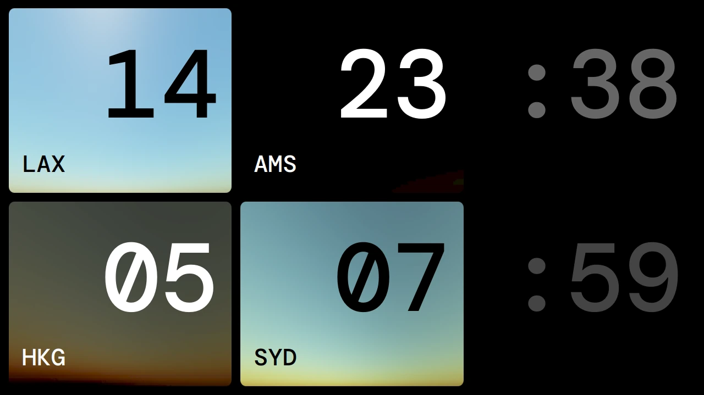

# SunClock

A basic world clock showing the time and sky color for 4 locations. I made this for a Raspberry Pi 4 with a 7" display attached that sits in my living room. I have friends around the globe and this little clock allows me to see if I'm still good to call them at a glance.

The clock can be configured using the config.json file next to the executable.
The locations are also defined in this file, use airport codes (IATA) and the program will use the stored latitude and longitude to determine the timezone and sun angles for the sky visualization.

Notes:
- Qt5 on Raspberry Pi seems to be configured/compiled without fontconfig support, so the included font doesn't properly display on the Pi.

Code reused from these wonderful people:
- https://github.com/kgodden/SolarAzEl
- https://github.com/scratchapixel/scratchapixel-code/tree/main/simulating-sky
